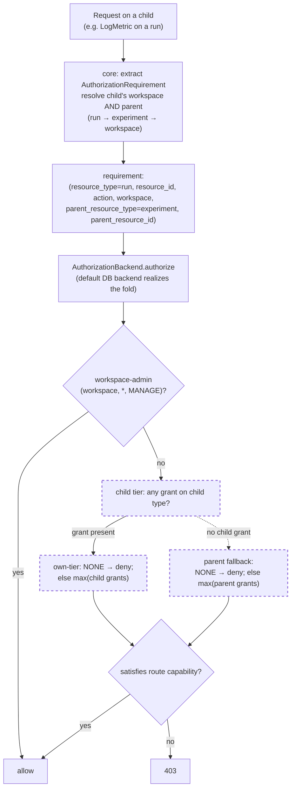

start_date:   2026-08-06
mlflow_issue: https://github.com/mlflow/mlflow/issues/11496
rfc_pr:

# Summary

MLflow's RBAC model recognizes a fixed set of top-level resource types
(`experiment`, `registered_model`, `prompt`, `scorer`, `mcp_server`,
`gateway_*`, `workspace`). Resources that are children of a permissionable
parent (e.g., runs and assessments under experiments, versions under registered
models) are **not** independently permissionable — every operation on them
resolves to the parent's permission level.

This RFC makes a curated set of child resource types **independently grantable**.
When the caller has any grant on the child type, the child is evaluated on its own
tier and the parent is not consulted; otherwise it falls back to the parent, exactly
as today. This is fully backward compatible — with no child grant, every child
inherits its parent's permission with no configuration change — and a positive child
grant *raises* the child above its inherited level (escalation).

It also introduces a `NONE` permission level for *restriction*: a `(child, NONE)`
grant denies the child even where the parent would grant access, letting an operator
carve out one sub-resource with a single additive grant while all other inheritance
stays intact. `NONE` is an absolute deny within its tier, evaluated ahead of the
`max` fold. However, the workspace-admin bypass takes precedence over `NONE`. See
[Enforcing permissions](#enforcing-permissions) for the full precedence.

# Basic example

Granting a child type raises it above its parent; a `NONE` grant denies it below the
parent; not granting it leaves it inheriting from the parent.

```python
# Baseline (unchanged from today): EDIT on experiment flows to all children.
client.add_role_permission(ds_role.id, "experiment", "*", "EDIT")
# → runs, traces, assessments all resolve to EDIT via inheritance.

# Validation-boundary evaluator: read everything, additionally WRITE assessments.
client.add_role_permission(evaluator_role.id, "experiment", "*", "READ")
client.add_role_permission(evaluator_role.id, "assessment", "*", "EDIT")
# → experiment/run/trace stay READ (inherited); assessment raised to EDIT.

# Run-logging service account (#11496): read the experiment, log runs — without
# gaining experiment-management (rename/delete) rights.
client.add_role_permission(pipeline_role.id, "experiment", "*", "READ")
client.add_role_permission(pipeline_role.id, "run", "*", "EDIT")
# → experiment stays READ (cannot rename/delete); runs raised to EDIT.

# Restriction (NONE): edit the experiment, but deny traces (e.g. they carry
# sensitive prompt content). One additive grant; all other inheritance untouched.
client.add_role_permission(restricted_role.id, "experiment", "*", "EDIT")
client.add_role_permission(restricted_role.id, "trace", "*", "NONE")
# → experiment/run/assessment stay EDIT (inherited); trace denied.
```

Effective permissions:

| User | experiment | run | trace | assessment |
|------|-----------|-----|-------|------------|
| data-scientist | EDIT | EDIT (inherited) | EDIT (inherited) | EDIT (inherited) |
| evaluator | READ | READ (inherited) | READ (inherited) | **EDIT** (raised) |
| pipeline | READ | **EDIT** (raised) | READ (inherited) | READ (inherited) |
| restricted | EDIT | EDIT (inherited) | **DENY** (NONE) | EDIT (inherited) |

## Motivation

RFC 0005 established workspace-scoped roles with permission grants on resource
types. Its `VALID_RESOURCE_TYPES` set covers only top-level resources —
sub-experiment resources (runs, traces, assessments, logged models) and registry
versions are not recognized, and their validators resolve to the parent's
permission level. Below are some use cases where this level of granularity is insufficient.

### Use cases
**1. Run logging without experiment management (#11496)**

Users need to log **runs** (e.g. to log models for registration) but must not
create, rename, delete, or otherwise **manage experiments** — only admins manage
experiments. Today run permissions inherit from the experiment, so the only way to
grant run-logging is to grant experiment `EDIT`, which also permits renaming and
tagging the experiment.

- **Example user:** a data scientist or pipeline role that logs runs into
  admin-created experiments.
- **Policy:** `(experiment, *, READ)` + `(run, *, EDIT)`
- **Result:** can discover/read experiments and create/log runs; cannot rename,
  delete, or manage experiments.

The experiment grant is `READ`, not lower: a user must be able to read an
experiment to discover and target it (`GetExperiment` / `SearchExperiments` require
experiment `can_read`). Run `EDIT` then supplies the create/log capability on runs.
Experiment *creation* is a separate workspace-level gate (USE/MANAGE), not experiment
EDIT, and is unchanged by this RFC.

**2. Assessment write access (validation boundary)**

A production app runs training/evaluation via a service role; end users only view
results and submit **feedback/assessments** through the UI. They must not modify or
delete runs, traces, models, or aliases. Today `CreateAssessment` requires
experiment `can_update` (EDIT), which also permits modifying runs and traces.

- **Example user:** a human evaluator who annotates results with assessments.
- **Policy:** `(experiment, *, READ)` + `(assessment, *, EDIT)`
- **Result:** can view everything and create/update assessments; cannot modify
  runs, traces, or experiments.

**3. Model-version logging without registry management**

Data scientists push new model versions; the platform team owns the registry
namespace (model names, descriptions, aliases). Today `CreateModelVersion`
requires the parent `registered_model`'s update capability, so enabling version
creation also permits managing the model entry.

- **Example user:** a data scientist who registers new versions of existing models.
- **Policy:** `(registered_model, *, READ)` + `(registered_model_version, *, EDIT)`
- **Result:** can create/update model versions; cannot rename, delete, or
  re-alias the registered model.

Making `registered_model_version` a first-class grantable type could also enable a future
capability this RFC does **not** include: condition-based access control on
versions — e.g. protecting versions that carry a given alias (`champion`,
`production`) or tag. Any such conditions would be a separate effort; this RFC
grants on the `registered_model_version` type at wildcard grain only.

**4. Restriction: deny a child below its inherited parent (`NONE`)**

The cases above are escalations. The inverse — *withholding* a child that
inheritance would otherwise grant — cannot be expressed by escalation and motivates
the `NONE` level:

- **Evaluator, stricter:** the assessment evaluator of case 2,
  additionally denied read on runs and models —
  `(experiment, *, READ)` + `(assessment, *, EDIT)` + `(run, *, NONE)` +
  `(logged_model, *, NONE)`. Views traces and writes assessments; runs and logged
  models are denied even though the experiment is readable.
- **Runs but not traces:** an analyst who may read run metrics/params but must not
  see trace payloads (sensitive prompt/response content) —
  `(experiment, *, READ)` + `(trace, *, NONE)`. Reads the experiment and its runs;
  traces are denied; other children keep inheriting.

Each is a single additive `NONE` grant layered on an otherwise unchanged inheriting
role — the parent grant and every other child stay intact. This is why `NONE` is in
scope: the inheritance model makes broad access the default, and some boundaries can
only be drawn by denying a specific child below it.

### Out of scope

- **Condition-based (attribute/tag) access control.** This RFC grants on resource
  *types* at wildcard grain; scoping a grant by attribute — e.g. model versions
  with a given alias (`champion`, `production`) or tag, traces for a given agent —
  is deferred to the condition-based access-control RFC. Making these types
  grantable here is what those future conditions attach to.
- **Request-level (pre-request) condition push-down for the new child types.**
  Efficient conditional filtering — injecting the caller's authorized predicate
  into the query before it hits the store (see mlflow/mlflow#24964) — is not added
  for `run`/`trace`/`assessment`/`registered_model_version` here. This RFC stays at wildcard
  grain precisely so search filtering needs no push-down (a single
  wildcard-can-read check per type); any future per-attribute or per-id conditional
  search for these types depends on that push-down mechanism and is deferred with
  the condition-based access-control work.
- **Per-individual-resource grants for high-cardinality children.** Grants on
  `run`/`trace`/`assessment` are supported at **wildcard** grain
  (`(trace, *, LEVEL)`) only; per-ID grants (`(trace, <trace_id>, LEVEL)`) are out
  of scope. The blocker is **search**: with per-ID grants, a `SearchTraces` result
  must be filtered to the caller's authorized ids, which today means post-response
  filtering — scan a page, drop unauthorized rows, re-fetch to refill — pathological
  for high-cardinality children. Efficient filtering needs the authorized predicate
  pushed into the store query before it runs; that pre-request push-down is the
  subject of [mlflow/mlflow#24964](https://github.com/mlflow/mlflow/issues/24964)
  (no merged PR yet). Wildcard grain sidesteps this entirely (one boolean per type),
  so per-ID grants are deferred until that mechanism lands.
- **Grants scoped to a collection defined by an attribute value** (e.g. a chatbot
  **session** — the traces sharing a session id). Session is **not a first-class
  field**: it is a trace **tag** — a key/value row in the `trace_tags` table with
  key `mlflow.trace.session` — not a column on `trace_info`, and there is no session
  table or API. So a session is not a DB resource this RFC's resource-type grants
  can attach to; it is an attribute predicate over traces. Such tag/attribute-
  predicate grants belong to the condition-based access-control RFC (which must
  support *additive* conditions for the escalation direction — raising one session
  above a read-only parent — to work). Same reasoning for any attribute-defined
  collection (per-agent, per-experiment).
- **Scoping child access to a parent boundary.** A child grant is workspace-wide
  (`(assessment, *)` matches every assessment in the workspace, across all
  experiments) or — in future — per-instance (per-id). There is no per-parent grain,
  so "assessment EDIT on the assessments *of one experiment*" (or of one agent)
  cannot be expressed as a single grant. This is deferred to the condition-based
  access-control RFC; making the child type grantable here is what such a
  parent-boundary (or attribute) condition attaches to.
- **Fine-grained auth for non-DB-indexed resources** (e.g. individual spans
  within a trace) — stored in blob/artifact storage, not independently queryable.
- **Tooling to ensure future contributions keep the auth route map complete.**
  This RFC adds and re-points entries in the validator map, but does not add a
  build/test-time check that every new or renamed route is wired to a validator.
  Guaranteeing coverage as the codebase evolves is a separate concern (and the
  fail-open/fail-closed default for an unmapped route is being handled upstream in
  [mlflow/mlflow#25308](https://github.com/mlflow/mlflow/pull/25308)).

## Detailed design
The design has two aspects, each a top-level section below:

1. **[Granting permissions](#granting-permissions)** — making the new resource types
   grantable and defining what a *valid* grant on them is, so an operator can only
   express permissions the model supports (which types and their metadata, and which
   `(resource_type, pattern, level)` grants are accepted or rejected).
2. **[Enforcing permissions](#enforcing-permissions)** — mapping an incoming request
   to a permission validator and running it to allow or deny (the entry point and
   validator map, and the permission fold — parent resolution, route re-pointing,
   and the `NONE` deny).

### Granting permissions

#### Grantable resource types
**Proposed methodology.** A child type is made independently grantable when we have
identified customer use cases in which the child needs a permission that differs from
its parent and from the other children under that parent. A child grant, when
present, is authoritative for that child: a positive grant *raises* it above its
inherited level (escalation), and a `NONE` grant *denies* it below the parent
(restriction). Children with no such use case keep inheriting from their parent,
which keeps the grant surface small. This is the inclusion criterion for this RFC and
future additions.

Two scoping principles bound the candidate set. First, this RFC targets only routes
that **already have resource-scoped authorization** — routes gated by authentication
alone (e.g. the generic job endpoints) or with no gate are outside the model, since
there is no parent permission to inherit from or escalate against. Second, as a
forward principle, new permissionable resources should be **DB-hosted, independently
queryable entities**: a grant matches against a stored `(resource_type, pattern)` and
search filtering requires the store to resolve the resource, so a type that is not
DB-indexed cannot participate in this model.

The set was derived by enumerating **both** ways `_before_request` dispatches a
validator, which exist because MLflow's routes come in two shapes:

1. **Exact-match map** (`BEFORE_REQUEST_VALIDATORS`) — a dict keyed by exact
   `(path, method)`, generated automatically from the proto service definitions.
   This covers routes with a **fixed path** (`/api/2.0/mlflow/runs/create`), where
   an O(1) dict lookup suffices.
2. **Regex/prefix dispatch** — for routes the exact map cannot key: those with a
   **path parameter** (e.g. `/mlflow/traces/<id>/tags`, logged-model and webhook
   routes), matched by regex in separate maps, and endpoints **not registered as
   proto routes at all** (the MCP server via `_get_mcp_server_validator`,
   artifact-proxy paths, `/v1/traces`), matched by `path.startswith(...)`.

For each route, across both mechanisms, we identified whether its permission
resolves to a **different** resource type than the resource acted on (i.e. it
inherits from a parent). Scanning both — not just the proto map — is what surfaces
`mcp_server`/`mcp_server_version`, which live only in the regex/prefix path and a
proto-map-only scan misses.

##### The model with sub-resources added

The **top-level** grantable types are unchanged by this RFC — they are what is
grantable today (`VALID_RESOURCE_TYPES`, plus `prompt`, which is grant-namespaced
separately). For completeness, the full set and whether each has a sub-resource
this RFC touches:

_Verified against MLflow 3.15.1 source._

| Top-level type | Sub-resource(s) in scope? |
|----------------|---------------------------|
| `workspace` | — (the root scope; parents everything) |
| `experiment` | `run`, `trace`, `assessment`, `logged_model`, `review_queue` (and `label_schema`, `prompt_optimization_job`, excluded) |
| `registered_model` | `registered_model_version` |
| `prompt` | `prompt_version` |
| `scorer` | `scorer_version` |
| `mcp_server` | `mcp_server_version` |
| `gateway_endpoint` | `gateway_endpoint_binding` (excluded) |
| `gateway_model_definition` | — |
| `gateway_secret` | — |

The table below then details every **sub-resource** and whether it becomes
independently grantable. The two tables together are the whole grantable model once
this RFC lands; sub-resources marked **Yes** are what it adds. All grants are
per-workspace.

| Parent | Sub-resource | Grantable? | Grain | Escalation use case | Addable later? |
|--------|--------------|------------|-------|---------------------|----------------|
| `experiment` | `run` | **Yes** | wildcard | log runs without experiment management | in scope |
| `experiment` | `trace` | **Yes** | wildcard | trace-level escalation alongside runs/assessments | in scope |
| `experiment` | `assessment` (via trace) | **Yes** | wildcard | write feedback/assessments while everything else stays READ | in scope |
| `experiment` | `logged_model` | **Yes** | wildcard | log models without experiment management (parallels runs) | in scope |
| `experiment` | `review_queue` | **Yes** | wildcard | operate a review/labeling queue (add/remove items) without experiment EDIT | in scope |
| `experiment` | `label_schema` | No | — | none today — authored by whoever manages the experiment | Yes |
| `experiment` | `prompt_optimization_job` | No | — | dormant entity — exists in the data model but has no active SDK/UI surface (candidate for removal), so no persona needs it | Yes |
| `registered_model` | `registered_model_version` | **Yes** | wildcard | push versions without registry management (use case 3) | in scope |
| `prompt` | `prompt_version` | **Yes** | wildcard | push prompt versions without managing the prompt entry (mirrors `registered_model_version`) | in scope |
| `scorer` | `scorer_version` | **Yes** | wildcard | push scorer versions without managing the scorer entry (mirrors `registered_model_version`) | in scope |
| `mcp_server` | `mcp_server_version` | **Yes** | wildcard | push MCP server versions without managing the server entry (mirrors `registered_model_version`) | in scope |
| `gateway_endpoint` | `gateway_endpoint_binding` | No | — | gated on the `gateway_endpoint` alone today (the endpoint controls create/delete/list of its bindings); the binding is a two-sided link (endpoint + consumer), and requiring both sides' permissions would change existing behavior — out of scope | No |

Notes:
- **Grain is wildcard-only in this RFC.** Every grantable child is at `*` grain;
  id-level grain (`(trace, <id>, …)`) will be added once request-level search-filter
  push-down is in place (see [Out of scope](#out-of-scope)).

#### Grant validation
When an operator **adds or updates a permission grant** (`grant_user_permission` /
the role-permission APIs), the input must be validated so only permissions the
model supports can be expressed.

Two of the three checks are **already enforced today** and need no change — the new
types simply flow through them:

- **The auth model must explicitly declare the resource type:** `_validate_resource_type`
  rejects any type not in `VALID_RESOURCE_TYPES` (which now includes the new children).
- **The permission level must be valid:** `get_permission` rejects anything that is
  not `READ`/`USE`/`EDIT`/`MANAGE`/`NONE` (`NONE` is the new absolute-deny level).

The **one new rule** is pattern validation, which does not exist today —
`resource_pattern` is currently passed to the store unchecked:

- **The pattern must be a kind the type declares:** `resource_pattern` must be an
  allowed grain in `TYPE[resource_type]` — so a concrete-id child grant
  (`(run, <run_id>, …)`) is rejected while `(run, *, …)` and a parent's
  `(experiment, "*" | id, …)` are accepted, enforcing the wildcard-only grain at the
  source rather than in the fold.

Rejections surface as a validation error on the grant API naming the offending
field, so the operator gets an explicit reason rather than a silently-ineffective
grant. The valid grants are therefore `(child_type, "*", LEVEL)` for any grantable
child — where `LEVEL` may be `NONE` to deny — or the existing
`(parent_type, "*" | id, LEVEL)` for a parent; anything else is refused up front.

### Enforcing permissions

An incoming request is authorized in two halves, matching the now-merged pluggable
auth model ([RFC 0008](https://github.com/mlflow/rfcs/blob/main/rfcs/0008-pluggable-auth/0008-pluggable-auth.md)):
**core** extracts a normalized `AuthorizationRequirement` from the request (no
decision), and an **`AuthorizationBackend`** decides allow/deny from it. This RFC
touches both halves minimally: core wires the child's **parent** through on the
requirement (exactly as it already wires `workspace`), and the default DB backend's
fold gains child-tier resolution with `NONE` deny. The subsections below cover the
requirement shape, the entry point/validator map that produces it, and the fold that
decides it.

The overall flow (dashed = added by this RFC):



The subsections below walk each box: the requirement + how core produces it, the
entry point/validator map, and the tier-override fold (escalation via `max`,
restriction via `NONE`).

#### The AuthorizationRequirement (parent wired through)

RFC 0008 hands the backend a normalized requirement and keeps route knowledge in
core. Today that requirement is a single leaf
`(resource_type, resource_id, action, workspace)`. To authorize a child under the
inheritance model, the backend needs the child's **parent** as well — and, exactly
like `workspace`, the parent is a **request-time containment fact the backend cannot
derive from the id alone**: a `run_id` no more declares its parent experiment than
its workspace. So core resolves it (RFC 0008's own `GetRun` example already resolves
run → experiment → workspace) and wires it through as two optional fields:

```python
@dataclass(frozen=True)
class AuthorizationRequirement:
    resource_type: str                        # child, e.g. "run"
    resource_id: str | None
    action: str
    workspace: str | None                     # core-resolved scope (existing)
    parent_resource_type: str | None = None   # (NEW) core-resolved parent, e.g. "experiment"
    parent_resource_id: str | None = None      # (NEW) e.g. experiment_id
```

This keeps the RFC 0008 contract intact — one requirement, one `authorize()`, one
`Decision`. Top-level resources leave
`parent_*` as `None` (mirroring `workspace=None` when workspaces are disabled), so
existing requirements are unchanged. Because the parent is on the wire, a
third-party backend *can* honor inheritance too; whether it does is the backend's
decision (RFC 0008: the backend owns the decision, core owns extraction). The
default DB backend honors it via the fold below.

#### Entry point and validator interface

**Today** every gated request passes through the Flask `_before_request` hook, which
looks up a validator in a route → callable map and denies if it returns false. **We
reuse that entry point and map.** **For sub-resources we only add/re-point entries**
in the map (a route now names the child validator) — no new dispatch mechanism.

The full call chain for a gated request:

```
_before_request(request)                     # Flask entry hook (auth, admin bypass)
  └─ _find_validator(request)                # proto class → validator, via BEFORE_REQUEST_HANDLERS
       (+ LOGGED_MODEL_/WEBHOOK_ maps; e.g. CreateRun: validate_can_update_run)
     └─ validator()                          # e.g. validate_can_update_run — the capability gate
          └─ _get_permission_from_run_id()   # the existing per-child resolver (custom logic)
               └─ get_role_permission_for_resource(user, resource_type, resource_id, workspace,
                                                    parent_type, parent_id)  # tier-override + NONE
          → .can_update / .can_read / …       # validator checks the resulting Permission
  → allow, or make_forbidden_response()       # 403 on failure
```

- **`_find_validator`** maps the request's proto class to a validator (the map this
  RFC re-points; `mcp_server`/artifact routes use path-based dispatch instead).
- **the validator** (`validate_can_*`) is the per-route capability gate — it calls a
  resolver and checks the resulting `Permission`'s `can_*` flag.
- **the resolver** (`_get_permission_from_*`, unchanged custom logic) resolves the
  parent + workspace (the values core wires onto the requirement's `parent_*` fields)
  and passes them to the fold. Detailed in
  [Proposed changes to the permission fold](#proposed-changes-to-the-permission-fold).
- **`get_role_permission_for_resource`** is the grant fold — the default backend's
  realization of the decision: workspace-admin bypass, then child-tier resolution
  (`NONE` deny / `max`), then parent fallback. Detailed in
  [Proposed changes to the permission fold](#proposed-changes-to-the-permission-fold).

Whether a route with no validator is allowed or denied (fail-open vs. fail-closed)
is a platform-level concern being addressed upstream in
[mlflow/mlflow#25308](https://github.com/mlflow/mlflow/pull/25308) and is orthogonal
to this RFC — the routes this RFC touches are all explicitly mapped.

#### The permission fold today

**Today** the validators call `get_role_permission_for_resource(...)`, a single
most-permissive fold: it loads the user's roles in the workspace and, in one pass,
`max_permission`s in every grant matching the queried resource — the workspace-wide
MANAGE grant, plus any grant on the queried `resource_type` at pattern `*` or the
resource id. A resource type is a bare string constant in a `frozenset` (no per-type
object), and inheritance is handled one level up: a child route (e.g.
`_get_permission_from_run_id`) resolves its parent and queries with the *parent's*
type (`resource_type="experiment"`), so a run's permission is whatever the experiment
fold returns. The real method, lightly elided:

```python
# permissions.py (today)
RESOURCE_TYPE_EXPERIMENT       = "experiment"
RESOURCE_TYPE_REGISTERED_MODEL = "registered_model"
RESOURCE_TYPE_PROMPT           = "prompt"
RESOURCE_TYPE_SCORER           = "scorer"
RESOURCE_TYPE_WORKSPACE        = "workspace"
# ... gateway_*, mcp_server
VALID_RESOURCE_TYPES = frozenset({RESOURCE_TYPE_EXPERIMENT, RESOURCE_TYPE_REGISTERED_MODEL, ...})

# SqlAlchemyStore.get_role_permission_for_resource (today) — uses the type strings directly
def get_role_permission_for_resource(self, user_id, resource_type, resource_id, workspace):
    with self.ManagedSessionMaker() as session:
        roles = ...                                      # load user's roles in `workspace`
        if not roles:
            return None
        best = None
        for role in roles:
            for rp in role.permissions:
                # workspace-admin fold
                if rp.resource_type == RESOURCE_TYPE_WORKSPACE and rp.resource_pattern == "*":
                    if resource_type == RESOURCE_TYPE_WORKSPACE or rp.permission == MANAGE.name:
                        best = max_permission(best, rp.permission)
                    continue
                # resource-type-specific fold — matches only the queried type, wildcard or its id
                if rp.resource_type == resource_type and rp.resource_pattern in ("*", resource_id):
                    best = max_permission(best, rp.permission)
        return get_permission(best) if best is not None else None
```

#### Proposed changes to the permission fold

**What we implement:** core resolves a child's parent today (e.g.
`_get_permission_from_run_id` loads the run and gets its `experiment_id`) and wires
it onto the requirement's `parent_*` fields. The default backend's fold takes the
child `(resource_type, resource_id)` and the parent `(parent_resource_type,
parent_resource_id)` and resolves them by **tier override**, not a cross-tier max:

1. **workspace-admin bypass** — a `(workspace, *, MANAGE)` grant allows outright
   (unchanged; evaluated ahead of everything, so admins are not restrictable);
2. **child tier** — if the caller has *any* grant on the child type: `NONE` among
   them denies, otherwise `max` of them. The parent is **not** consulted;
3. **parent fallback** — only if the caller has *no* grant on the child type: resolve
   the parent tier the same way (`NONE` denies, else `max`) — today's inheritance;
4. **default** — nothing at either tier → `default_permission`.

`NONE` is an absolute deny *within its tier*, evaluated ahead of the `max`; it does
**not** override downward (a parent `NONE` denies a child only via fallback, never
over a present child grant). Grants are matched at the **grain** the type declares —
parents at wildcard-or-id (today's behavior), children at wildcard only.

The concrete changes to the fold are: a resource-type registry declaring each type's
allowed grain, a `matches` key that honors it, and two new optional `parent_*`
arguments on `get_role_permission_for_resource` (the tier-override branching itself is
the [flow above](#enforcing-permissions)):

```python
class PatternKind(Enum):
    WILDCARD = auto()   # "*" — any resource of the type
    ID       = auto()   # an exact resource id
    # REGEX  = auto()   # future — not in this RFC

WILDCARD_AND_ID = frozenset({PatternKind.WILDCARD, PatternKind.ID})   # parent grain (today)
WILDCARD_ONLY   = frozenset({PatternKind.WILDCARD})                   # child grain (per-id deferred)

# resource-type registry: name → allowed grain. Replaces the bare VALID_RESOURCE_TYPES
# frozenset; membership is TYPE.keys(), so the valid-types set is derived, not maintained twice.
TYPE = {
    "workspace": WILDCARD_AND_ID, "experiment": WILDCARD_AND_ID,
    "registered_model": WILDCARD_AND_ID, "prompt": WILDCARD_AND_ID,
    "run": WILDCARD_ONLY, "trace": WILDCARD_ONLY, "assessment": WILDCARD_ONLY,
    "logged_model": WILDCARD_ONLY, "registered_model_version": WILDCARD_ONLY,
    # ... prompt_version, scorer_version, mcp_server_version, review_queue → WILDCARD_ONLY
}

def matches(rp, resource_type, resource_id):        # the match key, grain-aware
    patterns = TYPE[resource_type]
    return ((PatternKind.WILDCARD in patterns and rp.resource_pattern == "*")
            or (PatternKind.ID in patterns and rp.resource_pattern == resource_id))

# signature gains parent_type/parent_id (the requirement's parent_* fields); existing
# top-level callers pass neither and are unaffected. Body implements the tier override.
def get_role_permission_for_resource(self, user_id, resource_type, resource_id, workspace,
                                     parent_type=None, parent_id=None):   # (NEW) parent tier
    ...
```

`NONE` resolves to a `Permission` that fails every `can_*` check, so a validator
reading `.can_update` denies exactly as a missing grant would — the deny is carried
as a first-class level rather than as an absent permission. Wildcard-only children
match only `(child, *, …)` grants; a concrete-id child grant is rejected at grant
time (see [Grant validation](#grant-validation)).

Re-pointing a route means naming a **child** validator in `BEFORE_REQUEST_HANDLERS`
where it named the parent's, and giving that validator's resolver the child clause.
For `CreateRun`:

```python
# BEFORE_REQUEST_HANDLERS
- CreateRun: validate_can_update_experiment    # gated on the parent experiment
+ CreateRun: validate_can_update_run           # gated on the run (child), parent wired through

# the validator (same one-line shape as every validate_can_*)
+ def validate_can_update_run():
+     return _get_permission_from_run_id().can_update

# the resolver — today's parent/workspace resolution UNCHANGED; the run becomes the
# resolved resource and the experiment is wired through as the parent tier
  def _get_permission_from_run_id():
      run = get_run(run_id); experiment_id = run.info.experiment_id
      return _get_role_permission_or_default(_role_permission_for(
          resource_type="run", resource_key=run_id,                 # child — the resolved resource
          workspace_lookup_id=experiment_id, workspace_fetcher=get_experiment,
+         parent_type="experiment", parent_id=experiment_id,        # (NEW) parent tier (fallback)
      ))
```

`parent_type`/`parent_id` are what core stamps onto the requirement's `parent_*`
fields; the fold uses them only when the caller has no grant on `run`.

Below table summarrizes this for all APIs supported today:

| Route | Gate today (3.15.1) | Gate added under this RFC |
|-------|---------------------|---------------------|
| `CreateRun`, `LogMetric`, `LogBatch`, `SetTag`, `UpdateRun` | experiment `can_update` | `run` `can_update` |
| `StartTrace`, `SetTraceTag` | experiment `can_update` | `trace` `can_update` |
| `CreateAssessment`, `UpdateAssessment`, `DeleteAssessment` | trace→experiment `can_update` | `assessment` `can_update` |
| `CreateLoggedModel` | experiment `can_update` | `logged_model` `can_update` |
| `CreateModelVersion` | registered_model update | `registered_model_version` `can_update` |
| `CreateModelVersion` (prompt) | prompt update | `prompt_version` `can_update` |
| `CreateReviewQueue`, `AddItemsToReviewQueue`, `RemoveItemsFromReviewQueue` | experiment `can_update` (mixed) | `review_queue` `can_update` |
| `CreateScorer` (new version) | scorer `can_update` | `scorer_version` `can_update` |
| MCP server version create (`_is_mcp_server_version_create_path`) | mcp_server `can_update` | `mcp_server_version` `can_update` |

#### Performance

- **No child grant (the common/back-compat case):** the child tier resolves to empty
  and the fold falls back to the parent tier — the same rows it would have folded
  before. Both tiers are scanned over the role-permission rows **already loaded** for
  the workspace (the fold iterates them regardless); no new DB query.
- **Child grant present:** the child tier resolves and the parent is not consulted —
  strictly less work. The child grant is among the same already-loaded rows.
- **`NONE`:** a membership check for the deny level within the tier's grants, in the
  same in-memory pass. No additional round-trips in any case.
- **Under the pluggable backend (RFC 0008):** the parent rides on the *same*
  `AuthorizationRequirement` as an optional field (see
  [The AuthorizationRequirement](#the-authorizationrequirement-parent-wired-through)),
  so a child check is still **one** `authorize()` call, not two. Child-tier-first
  with parent fallback means the parent is resolved only when the child tier is
  empty, so the common case does no extra work; there is no separate parent
  `authorize()` round-trip to double the cost.

#### UI impact

The MLflow UI is a REST client of the same server: its data calls go through
`/ajax-api/2.0/...`, which the auth layer registers validators for **identically**
to `/api/2.0/...`. There is no separate UI authorization surface — only `/static`,
`/favicon.ico`, and `/health` are unprotected. So UI **search, create, edit, and
delete are already covered** by the base API surface this RFC modifies; no
UI-specific enforcement is added. The consequences are UX, not authorization:

- **Search / list views** reflect the wildcard read predicate automatically — a
  user with `(run, *, READ)` sees runs in list responses; one relying on inherited
  experiment READ sees the same as today. No client change required.
- **Create / edit / delete controls** will succeed or return 403 based on the
  re-pointed child gate. A user who previously could log runs *only* because they
  held experiment EDIT is unaffected (that grant still inherits and satisfies the
  child capability); a user newly granted `(run, *, EDIT)` can now use those
  controls without experiment EDIT. The UI does not need to know which grant
  satisfied the check.
- **Parent discovery still requires parent READ.** A child grant raises only the
  child, never the parent (grants never flow upward). So a user with just
  `(run, *, EDIT)` does **not** thereby see the experiment the run lives in —
  listing/opening experiments gates on `(experiment, …)` READ, a different resource
  type the run grant never matches. To navigate to a run in the UI a user needs
  experiment READ as well, which is why the run-logging use case pairs them:
  `(experiment, *, READ)` + `(run, *, EDIT)`. This matches today's behavior — child
  access has never implied parent visibility.
- **Optional (not required):** the UI could gray out controls the caller lacks
  capability for, but MLflow's UI does not do capability-driven control hiding
  today, so this RFC does not add it — a 403 on action is the existing pattern and
  remains correct.

## Drawbacks

- **More grants per role when escalation is used.** A role that needs child-level
  access must add a child grant per type. Mitigated: unused child types simply
  inherit; only roles that need escalation add grants.
- **`NONE` makes the model non-monotonic.** Adding a `NONE` grant *reduces* a user's
  access, unlike every positive grant. This is the price of restriction and is a
  one-way door — once roles rely on `NONE` deny semantics, they cannot be removed
  without changing those roles' effective access. Contained: `NONE` is only
  evaluated within its own tier, never overrides a present child grant downward, and
  the workspace-admin bypass is unaffected.

# Alternatives

### A. Two-mode flag (`simplified` / `fine_grained`)

A global config flag selects between "children always inherit" and "children are
independently permissioned." **Rejected:** it is all-or-nothing, maintains two
resolution regimes behind a branch, and requires a mode-transition story
(pre-creating grants before flipping). The `max` model needs no flag — inheritance is
simply `max` with no child grant present.

### B. `inherit` flag instead of `NONE` (Model A)

Keep escalation-only `max` and express *restriction* by a per-child-type
`inherit=true|false` toggle rather than a `NONE` grant: `inherit=false` drops the
parent fallback, so a child with no explicit grant is denied. **Rejected in favor of
`NONE`:**

- **Migration.** Restricting one sub-resource with `NONE` is a single additive grant
  (`(trace, *, NONE)`) that leaves the existing `(experiment, *, EDIT)` and all other
  inheritance untouched — a surgical carve-out. `inherit=false` instead *detaches*
  the child from inheritance and forces re-declaring whatever access was still
  wanted (detach-and-redeclare, not a patch).
- **Mental model.** "Grant broadly, deny the exceptions" is more familiar than
  reasoning about per-child inheritance topology.
- **No refactor saving.** The tiered/parent-aware fold is required by inheritance
  regardless (it is a consequence of wiring the parent through), so `inherit` buys no
  simpler resolver — and `inherit=true` vs `false` itself branches the fold into two
  decision trees, eroding the "single monotonic pass" it was meant to preserve.
- **Granularity.** `inherit=false` is all-or-nothing per child type; `NONE` restricts
  per child type/instance and composes with escalation grants on other children.

### C. Downward-override / most-specific-wins (child fully replaces parent)

A child grant *replaces* the parent, so any child grant — positive or `NONE` —
overrides the inherited level in both directions. **Rejected:** we keep child grants
authoritative only *when present* and `NONE` as an explicit deny, but do **not** let
a lower positive child grant silently reduce inherited access beyond an explicit
`NONE`; and, critically, a parent `NONE` does **not** override a present child grant
downward (it denies a child only via fallback). Full most-specific-wins in both
directions makes "adding a positive grant reduces access" possible, which is more
surprising than a single explicit deny level.

### D. Capability-split or action-based permissions

Split `EDIT` into `EDIT_RUNS`/`EDIT_TRACES`, or grant per-action. **Rejected:**
breaks the scalar permission hierarchy `max_permission` depends on, and
contradicts RFC 0005's level-based design. N² explosion in admin UX.

# Adoption strategy

**Not a breaking change.** With no child grants configured, every child inherits
from its parent exactly as today — no configuration and no behavior change on
upgrade.

Operators who want child-level escalation:
1. Upgrade (no behavior change).
2. Add wildcard child grants where a role needs more access to a child than its
   parent grant gives (e.g. `(assessment, *, EDIT)` for evaluators,
   `(run, *, EDIT)` for logging service accounts).
3. Optionally downgrade the parent grant now that the child is granted directly
   (e.g. experiment `EDIT` → `READ` once `(run, *, EDIT)` covers logging).

Operators who want child-level restriction:
1. Add a `(child, *, NONE)` grant to deny one child type while the parent grant and
   all other inheritance stay intact (e.g. `(trace, *, NONE)` to hide traces from a
   role that keeps experiment `EDIT`).

There is no mode to flip: removing a child grant — positive or `NONE` — returns that
child to pure inheritance.
